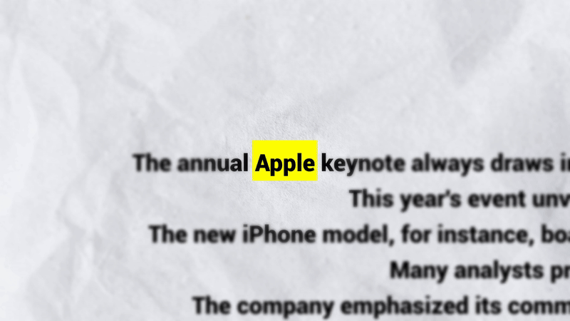

<p align="center" style="text-align: center">
  <br/>
</p>

<h1 align="center">TextMatchCut</h1>

<p align="center">
  A free, open-source, cross-platform desktop (webapp) to generate TextMatchCut. Built with Wails, Go, and React. Runs locally
  <br/>
  <br/>
  <a href="https://github.com/TextMatchCut/TextMatchCut/actions/workflows/build.yml" rel="nofollow">
    
  </a>
  <a href="https://github.com/TextMatchCut/TextMatchCut/releases/latest" rel="nofollow">
    
  </a>
    <a href="https://github.com/TextMatchCut/TextMatchCut/issues">
    
  </a>
  
</p>

## Examples

<p align="center">
    <br/>
    <br/>
    <br/>
    <br/>
    <br/>
</p>

## Download

You can download the latest version for your operating system from the [**Releases**](https://github.com/TextMatchCut/TextMatchCut/releases/latest) page.

### Installation Instructions

🚨🚨🚨🚨**IMPORTANT:** **YOU NEED TO HAVE FFMPEG INSTALLED** 🚨🚨🚨

It doesn't make any sense to bundle FFMPEG with this app so you need to install it yourself. The instructions below assume you have FFMPEG installed and available in your system PATH.

#### Windows

1.  Download the `TextMatchCut-*-windows-amd64.exe` file from the latest release.
2.  Run the executable.

#### macOS

The application is a **universal binary**, compatible with both Apple Silicon and Intel-based Macs.

1.  Download the `TextMatchCut-*-darwin-universal.dmg` file.
2.  Open the `.dmg` and drag `TextMatchCut.app` to your Applications folder.

**Important:** Since the app is not notarized by Apple, you will need to bypass Gatekeeper to run it for the first time.

- **Option 1 (Recommended):**

  1.  Go to `System Settings` > `Privacy & Security`.
  2.  Scroll down to the `Security` section.
  3.  You will see a message that "TextMatchCut.app" was blocked. Click the `Open Anyway` button.

- **Option 2 (Terminal):**
  Open Terminal and run the following command after draggeing the app to your Applications folder:
  ```shell
  xattr -cr /Applications/TextMatchCut.app
  ```

#### Linux

1.  Download the `TextMatchCut-*-linux-amd64` binary.
2.  Make the file executable by running `chmod +x ./TextMatchCut-*-linux-amd64` in your terminal.
3.  Run the application: `./TextMatchCut-*-linux-amd64`

## Donate

If you find TextMatchCut useful and would like to support its development, consider donating:

- [Crypto](https://uncore.me/donate)

## License

This project is licensed under the MIT License. See the [LICENSE](LICENSE) file for details

## Linux Notes

Linux could be tricky due to the variety of distributions and configurations. If you miss anything from here it is not going to open

```shell
->ldd build/bin/TextMatchCut
        linux-vdso.so.1 (0x00007f3fcd9ba000)
        libresolv.so.2 => /usr/lib/libresolv.so.2 (0x00007f3fcd978000)
        libwebkit2gtk-4.0.so.37 => /usr/lib/libwebkit2gtk-4.0.so.37 (0x00007f3fc8400000)
        libgtk-3.so.0 => /usr/lib/libgtk-3.so.0 (0x00007f3fc7c00000)
        libgdk-3.so.0 => /usr/lib/libgdk-3.so.0 (0x00007f3fcd88c000)
        libz.so.1 => /usr/lib/libz.so.1 (0x00007f3fcd873000)
        libpangocairo-1.0.so.0 => /usr/lib/libpangocairo-1.0.so.0 (0x00007f3fcd863000)
        libcairo-gobject.so.2 => /usr/lib/libcairo-gobject.so.2 (0x00007f3fcd858000)
        libgdk_pixbuf-2.0.so.0 => /usr/lib/libgdk_pixbuf-2.0.so.0 (0x00007f3fcd820000)
        libatk-1.0.so.0 => /usr/lib/libatk-1.0.so.0 (0x00007f3fcd7fa000)
        libpango-1.0.so.0 => /usr/lib/libpango-1.0.so.0 (0x00007f3fc8395000)
        libcairo.so.2 => /usr/lib/libcairo.so.2 (0x00007f3fc7ac3000)
        libharfbuzz.so.0 => /usr/lib/libharfbuzz.so.0 (0x00007f3fc798a000)
        libsoup-2.4.so.1 => /usr/lib/libsoup-2.4.so.1 (0x00007f3fc78f0000)
        libgio-2.0.so.0 => /usr/lib/libgio-2.0.so.0 (0x00007f3fc771e000)
        libgmodule-2.0.so.0 => /usr/lib/libgmodule-2.0.so.0 (0x00007f3fcd7f1000)
        libjavascriptcoregtk-4.0.so.18 => /usr/lib/libjavascriptcoregtk-4.0.so.18 (0x00007f3fc5200000)
        libgobject-2.0.so.0 => /usr/lib/libgobject-2.0.so.0 (0x00007f3fc8336000)
        libglib-2.0.so.0 => /usr/lib/libglib-2.0.so.0 (0x00007f3fc75c6000)
        libc.so.6 => /usr/lib/libc.so.6 (0x00007f3fc4e00000)
        libepoxy.so.0 => /usr/lib/libepoxy.so.0 (0x00007f3fc50f3000)
        libfreetype.so.6 => /usr/lib/libfreetype.so.6 (0x00007f3fc5023000)
        libfontconfig.so.1 => /usr/lib/libfontconfig.so.1 (0x00007f3fc4daf000)
        libwebpmux.so.3 => /usr/lib/libwebpmux.so.3 (0x00007f3fcd7e3000)
        libexpat.so.1 => /usr/lib/libexpat.so.1 (0x00007f3fc830b000)
        libicui18n.so.76 => /usr/lib/libicui18n.so.76 (0x00007f3fc4a00000)
        libsystemd.so.0 => /usr/lib/libsystemd.so.0 (0x00007f3fc48da000)
        libjpeg.so.8 => /usr/lib/libjpeg.so.8 (0x00007f3fc4838000)
        libpng16.so.16 => /usr/lib/libpng16.so.16 (0x00007f3fc758c000)
        libicuuc.so.76 => /usr/lib/libicuuc.so.76 (0x00007f3fc4600000)
        libxml2.so.16 => /usr/lib/libxml2.so.16 (0x00007f3fc44cb000)
        libsqlite3.so.0 => /usr/lib/libsqlite3.so.0 (0x00007f3fc4359000)
        libxslt.so.1 => /usr/lib/libxslt.so.1 (0x00007f3fc431c000)
        liblcms2.so.2 => /usr/lib/liblcms2.so.2 (0x00007f3fc42b6000)
        libwoff2dec.so.1.0.2 => /usr/lib/libwoff2dec.so.1.0.2 (0x00007f3fc82fe000)
        libgcrypt.so.20 => /usr/lib/libgcrypt.so.20 (0x00007f3fc411c000)
        libgstallocators-1.0.so.0 => /usr/lib/libgstallocators-1.0.so.0 (0x00007f3fc501a000)
        libgstapp-1.0.so.0 => /usr/lib/libgstapp-1.0.so.0 (0x00007f3fc4d9a000)
        libgstbase-1.0.so.0 => /usr/lib/libgstbase-1.0.so.0 (0x00007f3fc4099000)
        libgstreamer-1.0.so.0 => /usr/lib/libgstreamer-1.0.so.0 (0x00007f3fc3f3e000)
        libgstpbutils-1.0.so.0 => /usr/lib/libgstpbutils-1.0.so.0 (0x00007f3fc3efc000)
        libgstaudio-1.0.so.0 => /usr/lib/libgstaudio-1.0.so.0 (0x00007f3fc3e78000)
        libgsttag-1.0.so.0 => /usr/lib/libgsttag-1.0.so.0 (0x00007f3fc3e3b000)
        libgstvideo-1.0.so.0 => /usr/lib/libgstvideo-1.0.so.0 (0x00007f3fc3d67000)
        libgstgl-1.0.so.0 => /usr/lib/libgstgl-1.0.so.0 (0x00007f3fc3cd6000)
        libgstfft-1.0.so.0 => /usr/lib/libgstfft-1.0.so.0 (0x00007f3fc4d8f000)
        libwebpdemux.so.2 => /usr/lib/libwebpdemux.so.2 (0x00007f3fc5013000)
        libwebp.so.7 => /usr/lib/libwebp.so.7 (0x00007f3fc3c4f000)
        libjxl.so.0.11 => /usr/lib/libjxl.so.0.11 (0x00007f3fc3800000)
        libavif.so.16 => /usr/lib/libavif.so.16 (0x00007f3fc3c10000)
        libharfbuzz-icu.so.0 => /usr/lib/libharfbuzz-icu.so.0 (0x00007f3fc4d8a000)
        libenchant-2.so.2 => /usr/lib/libenchant-2.so.2 (0x00007f3fc4827000)
        libsecret-1.so.0 => /usr/lib/libsecret-1.so.0 (0x00007f3fc3bb2000)
        libtasn1.so.6 => /usr/lib/libtasn1.so.6 (0x00007f3fc4811000)
        libhyphen.so.0 => /usr/lib/libhyphen.so.0 (0x00007f3fc4d83000)
        libX11.so.6 => /usr/lib/libX11.so.6 (0x00007f3fc36bf000)
        libwayland-server.so.0 => /usr/lib/libwayland-server.so.0 (0x00007f3fc3b9d000)
        libwayland-client.so.0 => /usr/lib/libwayland-client.so.0 (0x00007f3fc3b8d000)
        libm.so.6 => /usr/lib/libm.so.6 (0x00007f3fc35b1000)
        libmanette-0.2.so.0 => /usr/lib/libmanette-0.2.so.0 (0x00007f3fc3563000)
        libseccomp.so.2 => /usr/lib/libseccomp.so.2 (0x00007f3fc3b6c000)
        libgbm.so.1 => /usr/lib/libgbm.so.1 (0x00007f3fc480b000)
        libdrm.so.2 => /usr/lib/libdrm.so.2 (0x00007f3fc3b55000)
        libstdc++.so.6 => /usr/lib/libstdc++.so.6 (0x00007f3fc3200000)
        libgcc_s.so.1 => /usr/lib/libgcc_s.so.1 (0x00007f3fc3536000)
        /lib64/ld-linux-x86-64.so.2 => /usr/lib64/ld-linux-x86-64.so.2 (0x00007f3fcd9bc000)
        libpangoft2-1.0.so.0 => /usr/lib/libpangoft2-1.0.so.0 (0x00007f3fc3518000)
        libfribidi.so.0 => /usr/lib/libfribidi.so.0 (0x00007f3fc34f8000)
        libXi.so.6 => /usr/lib/libXi.so.6 (0x00007f3fc34e5000)
        libatk-bridge-2.0.so.0 => /usr/lib/libatk-bridge-2.0.so.0 (0x00007f3fc34a9000)
        libcloudproviders.so.0 => /usr/lib/libcloudproviders.so.0 (0x00007f3fc31e8000)
        libtinysparql-3.0.so.0 => /usr/lib/libtinysparql-3.0.so.0 (0x00007f3fc3117000)
        libXfixes.so.3 => /usr/lib/libXfixes.so.3 (0x00007f3fc4803000)
        libxkbcommon.so.0 => /usr/lib/libxkbcommon.so.0 (0x00007f3fc30bd000)
        libwayland-cursor.so.0 => /usr/lib/libwayland-cursor.so.0 (0x00007f3fc349f000)
        libwayland-egl.so.1 => /usr/lib/libwayland-egl.so.1 (0x00007f3fc3b50000)
        libXext.so.6 => /usr/lib/libXext.so.6 (0x00007f3fc30a8000)
        libXcursor.so.1 => /usr/lib/libXcursor.so.1 (0x00007f3fc309b000)
        libXdamage.so.1 => /usr/lib/libXdamage.so.1 (0x00007f3fc349a000)
        libXcomposite.so.1 => /usr/lib/libXcomposite.so.1 (0x00007f3fc3495000)
        libXrandr.so.2 => /usr/lib/libXrandr.so.2 (0x00007f3fc308e000)
        libXinerama.so.1 => /usr/lib/libXinerama.so.1 (0x00007f3fc3089000)
        libglycin-2.so.0 => /usr/lib/libglycin-2.so.0 (0x00007f3fc2c00000)
        libthai.so.0 => /usr/lib/libthai.so.0 (0x00007f3fc307c000)
        libXrender.so.1 => /usr/lib/libXrender.so.1 (0x00007f3fc3070000)
        libxcb.so.1 => /usr/lib/libxcb.so.1 (0x00007f3fc3045000)
        libxcb-render.so.0 => /usr/lib/libxcb-render.so.0 (0x00007f3fc3036000)
        libxcb-shm.so.0 => /usr/lib/libxcb-shm.so.0 (0x00007f3fc3031000)
        libpixman-1.so.0 => /usr/lib/libpixman-1.so.0 (0x00007f3fc2b51000)
        libgraphite2.so.3 => /usr/lib/libgraphite2.so.3 (0x00007f3fc2b2e000)
        libpsl.so.5 => /usr/lib/libpsl.so.5 (0x00007f3fc2b1a000)
        libbrotlidec.so.1 => /usr/lib/libbrotlidec.so.1 (0x00007f3fc2b0b000)
        libgssapi_krb5.so.2 => /usr/lib/libgssapi_krb5.so.2 (0x00007f3fc2ab8000)
        libmount.so.1 => /usr/lib/libmount.so.1 (0x00007f3fc2a62000)
        libatomic.so.1 => /usr/lib/libatomic.so.1 (0x00007f3fc2a57000)
        libffi.so.8 => /usr/lib/libffi.so.8 (0x00007f3fc2a4b000)
        libpcre2-8.so.0 => /usr/lib/libpcre2-8.so.0 (0x00007f3fc29a0000)
        libbz2.so.1.0 => /usr/lib/libbz2.so.1.0 (0x00007f3fc298d000)
        libcap.so.2 => /usr/lib/libcap.so.2 (0x00007f3fc2981000)
        libicudata.so.76 => /usr/lib/libicudata.so.76 (0x00007f3fc0a00000)
        libwoff2common.so.1.0.2 => /usr/lib/libwoff2common.so.1.0.2 (0x00007f3fc297c000)
        libgpg-error.so.0 => /usr/lib/libgpg-error.so.0 (0x00007f3fc2951000)
        libunwind.so.8 => /usr/lib/libunwind.so.8 (0x00007f3fc2936000)
        libdw.so.1 => /usr/lib/libdw.so.1 (0x00007f3fc289a000)
        liborc-0.4.so.0 => /usr/lib/liborc-0.4.so.0 (0x00007f3fc0956000)
        libEGL.so.1 => /usr/lib/libEGL.so.1 (0x00007f3fc2888000)
        libGLX.so.0 => /usr/lib/libGLX.so.0 (0x00007f3fc0925000)
        libX11-xcb.so.1 => /usr/lib/libX11-xcb.so.1 (0x00007f3fc2883000)
        libgudev-1.0.so.0 => /usr/lib/libgudev-1.0.so.0 (0x00007f3fc2877000)
        libsharpyuv.so.0 => /usr/lib/libsharpyuv.so.0 (0x00007f3fc286c000)
        libjxl_cms.so.0.11 => /usr/lib/libjxl_cms.so.0.11 (0x00007f3fc08eb000)
        libhwy.so.1 => /usr/lib/libhwy.so.1 (0x00007f3fc08dc000)
        libbrotlienc.so.1 => /usr/lib/libbrotlienc.so.1 (0x00007f3fc0822000)
        libyuv.so => /usr/lib/libyuv.so (0x00007f3fc0780000)
        libdav1d.so.7 => /usr/lib/libdav1d.so.7 (0x00007f3fc059e000)
        librav1e.so.0.7 => /usr/lib/librav1e.so.0.7 (0x00007f3fc0200000)
        libSvtAv1Enc.so.3 => /usr/lib/libSvtAv1Enc.so.3 (0x00007f3fb7a00000)
        libaom.so.3 => /usr/lib/libaom.so.3 (0x00007f3fb7000000)
        libtss2-esys.so.0 => /usr/lib/libtss2-esys.so.0 (0x00007f3fc0177000)
        libtss2-mu.so.0 => /usr/lib/libtss2-mu.so.0 (0x00007f3fc0559000)
        libtss2-rc.so.0 => /usr/lib/libtss2-rc.so.0 (0x00007f3fc0550000)
        libtss2-tctildr.so.0 => /usr/lib/libtss2-tctildr.so.0 (0x00007f3fc0548000)
        libhidapi-hidraw.so.0 => /usr/lib/libhidapi-hidraw.so.0 (0x00007f3fc0540000)
        libevdev.so.2 => /usr/lib/libevdev.so.2 (0x00007f3fc052b000)
        libatspi.so.0 => /usr/lib/libatspi.so.0 (0x00007f3fc013e000)
        libdbus-1.so.3 => /usr/lib/libdbus-1.so.3 (0x00007f3fc00eb000)
        libjson-glib-1.0.so.0 => /usr/lib/libjson-glib-1.0.so.0 (0x00007f3fb79d6000)
        libdatrie.so.1 => /usr/lib/libdatrie.so.1 (0x00007f3fc0522000)
        libXau.so.6 => /usr/lib/libXau.so.6 (0x00007f3fc051d000)
        libXdmcp.so.6 => /usr/lib/libXdmcp.so.6 (0x00007f3fc00e3000)
        libunistring.so.5 => /usr/lib/libunistring.so.5 (0x00007f3fb6e1d000)
        libidn2.so.0 => /usr/lib/libidn2.so.0 (0x00007f3fb79b4000)
        libbrotlicommon.so.1 => /usr/lib/libbrotlicommon.so.1 (0x00007f3fb7991000)
        libkrb5.so.3 => /usr/lib/libkrb5.so.3 (0x00007f3fb6d57000)
        libk5crypto.so.3 => /usr/lib/libk5crypto.so.3 (0x00007f3fb7964000)
        libcom_err.so.2 => /usr/lib/libcom_err.so.2 (0x00007f3fc00db000)
        libkrb5support.so.0 => /usr/lib/libkrb5support.so.0 (0x00007f3fc00cd000)
        libkeyutils.so.1 => /usr/lib/libkeyutils.so.1 (0x00007f3fb795d000)
        libblkid.so.1 => /usr/lib/libblkid.so.1 (0x00007f3fb7923000)
        liblzma.so.5 => /usr/lib/liblzma.so.5 (0x00007f3fb78ef000)
        libelf.so.1 => /usr/lib/libelf.so.1 (0x00007f3fb78d3000)
        libzstd.so.1 => /usr/lib/libzstd.so.1 (0x00007f3fb6c72000)
        libGLdispatch.so.0 => /usr/lib/libGLdispatch.so.0 (0x00007f3fb6bf9000)
        libudev.so.1 => /usr/lib/libudev.so.1 (0x00007f3fb6bb1000)
        libcrypto.so.3 => /usr/lib/libcrypto.so.3 (0x00007f3fb6600000)
        libtss2-sys.so.1 => /usr/lib/libtss2-sys.so.1 (0x00007f3fb6b90000)
```

## Thanks

Minecraft Font was taken from the following link:
https://www.dafont.com/minecraft.font

Background Image are taken from the following link:
https://www.freepik.com/free-photo/white-paper-texture_1012237.htm#fromView=keyword&page=1&position=1&uuid=19525ec7-ddbd-421f-b1be-0d1208d51fe3&query=Newspaper+Texture

shutter1 was taken from Sound Effect by <a href="https://pixabay.com/users/voicebosch-30143949/?utm_source=link-attribution&utm_medium=referral&utm_campaign=music&utm_content=187326">Otto</a> from <a href="https://pixabay.com//?utm_source=link-attribution&utm_medium=referral&utm_campaign=music&utm_content=187326">Pixabay</a>
